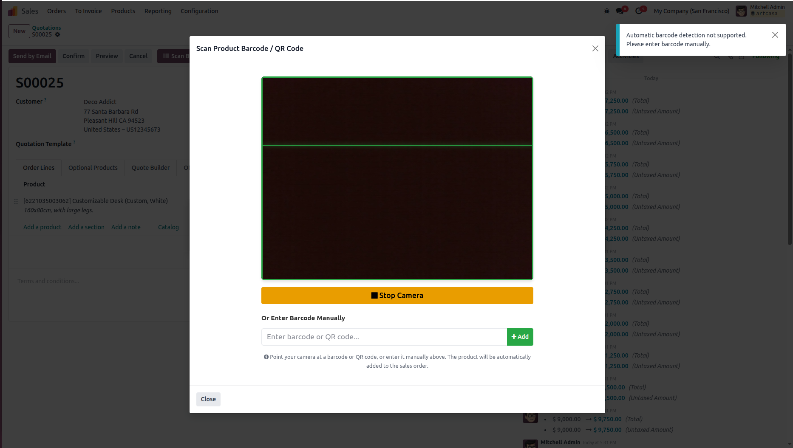
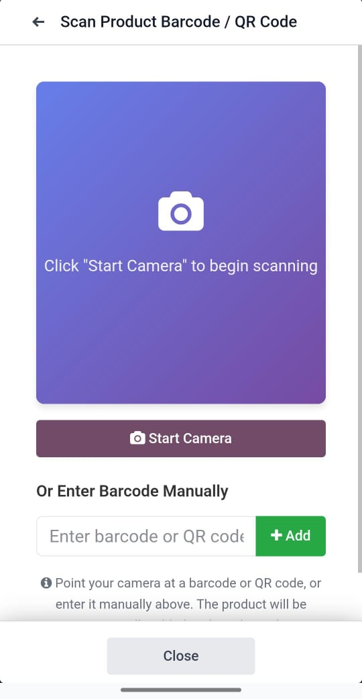

Sale Order Barcode Scanner
============================

Scan products by Barcode/QRCode in sales orders using mobile camera or webcam.

Preview
=======

Desktop Interface
-----------------

The scanner interface on desktop showing camera preview and manual barcode entry option.

Mobile Interface
----------------

The scanner interface on mobile devices with responsive design and touch-friendly controls.

Features
========

* **Easy Product Scanning**: Scan products directly from sales order lines using barcode or QR code
* **Mobile & Webcam Support**: Works with mobile device cameras and desktop webcams
* **Multiple Barcode Formats**: Supports QR codes, EAN-13, EAN-8, Code-128, Code-39, UPC-A, and UPC-E
* **Manual Entry**: Fallback option to enter barcodes manually
* **Smart Quantity Management**: Automatically increments quantity if product already exists in order
* **Real-time Feedback**: Visual and notification feedback for scanned products
* **User-Friendly Interface**: Clean, intuitive scanning interface with camera preview

Installation
============

1. Copy this module to your Odoo addons directory
2. Update the app list: Go to Apps > Update Apps List
3. Search for "Sale Order Barcode Scanner"
4. Click Install

Configuration
=============

No additional configuration needed. The module works out of the box.

**Note**: For camera access, ensure your browser has camera permissions enabled.

Usage
=====

1. Open a Sales Order (in draft state)
2. Click the **"Scan Barcode"** button in the header
3. Grant camera access when prompted
4. Click **"Start Camera"** to activate scanning
5. Point your camera at a product barcode or QR code
6. The product will be automatically added to the order lines
7. If the product already exists, quantity will be incremented by 1

**Alternative Method**: Enter barcode manually in the text field and click "Add"

Supported Barcode Types
========================

* QR Code
* EAN-13
* EAN-8
* Code-128
* Code-39
* UPC-A
* UPC-E

Requirements
============

* Odoo 18.0 (Community and Enterprise editions)
* sale_management module
* product module
* barcodes module
* Modern browser with camera access and BarcodeDetector API support
  (Chrome 83+, Edge 83+, or browsers with polyfill)

Compatibility
=============

* **Odoo Community Edition**: Fully compatible
* **Odoo Enterprise Edition**: Fully compatible
* **Version**: 18.0

This module works seamlessly with both Odoo Community and Enterprise editions without any additional configuration.

Browser Compatibility
=====================

**Full Support** (Native BarcodeDetector API):
* Google Chrome 83+
* Microsoft Edge 83+
* Opera 69+

**Partial Support** (Manual entry only):
* Firefox (requires manual barcode entry)
* Safari (requires manual barcode entry)

Tips
====

* Ensure adequate lighting for better barcode recognition
* Hold the barcode steady and at a reasonable distance from camera
* Use the back camera on mobile devices for better scanning
* If automatic detection doesn't work, use manual entry as fallback
* Products must have barcodes set in Product form for scanning to work

Troubleshooting
===============

**Camera not working?**
* Check browser permissions for camera access
* Ensure you're using HTTPS (required for camera access)
* Try a different browser (Chrome/Edge recommended)

**Barcode not detected?**
* Ensure the barcode is clear and well-lit
* Try adjusting the distance from camera
* Use manual entry as alternative

**Product not found?**
* Verify the product has the barcode set in Odoo
* Check barcode format matches product's barcode field
* Product default_code can also be used as barcode

Credits
=======

Author: Mohamed Helmy

Website: https://helmy.info

Version: 18.0.1.0.0

License: Other proprietary

Maintainer
==========

This module is maintained by Mohamed Helmy.

For support, please visit: https://helmy.info
